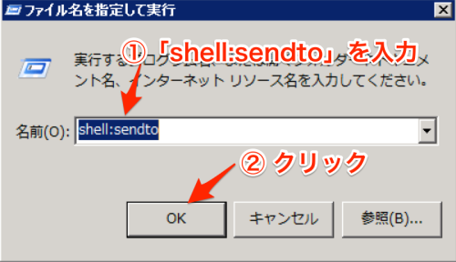

% Unzip4Winマニュアル  
%   
% 2019/02/25  

Unzip4winは、「固定の文字列と日付文字列を組み合わせる」というルールに従ったパスワードのついたZIPファイルを展開するツールです。

例：

* password20190222
* 20190222password
* pass20190222word

# 使い方

PC上のUnzip4Winのアプリケーションファイル（もしくはそのショートカット）へZIPファイルをDrag & Dropするだけで展開します。
[右クリックの「送る」に追加する](#sendto)を実施している場合は、ZIPファイルを右クリックしてunzip4winへ「送る」だけで展開も可能です。
展開後のファイルは、元のzipファイルと同じフォルダに保存されます。

当日から100日前までの日付についてパスワードが一致するまで試行を行い、その間にパスワードが一致した場合に展開します。
試行回数以内にパスワードが一致しない場合は展開に失敗します。

# インストール（アップグレード）方法

入手したUnzip4Winのzipファイル（unzip4win_windows.zip）を適当なフォルダで展開します。
以下、 `マイドキュメント`配下に展開するものとして説明します。

1. 入手したzipファイル（`unzip4win_windows.zip`）をマイドキュメントに保存します。

    

1. 「`マイドキュメント`」の「`unzip4win_windows.zip`」をダブルクリックしてzipファイルの中に移動します。

    

1. ツールバー上の「`ファイルをすべて展開`」をクリックします。

    

1. 「`圧縮（ZIP形式）フォルダーの展開`」ウィンドウが開くので、「`展開`」ボタンをクリックします。

    
    
    * アップグレード時には「`ファイルのコピー`」ウィンドウが開くので「`コピーして置き換える`」を選択します。
    
    
    
1. 以上でインストール（アップグレード）は完了です。

### ショートカットを作成する {#shortcut}

本アプリケーションは、ショートカットを利用することでもZIPファイルの展開が可能です。
ここでは、Windowsのデスクトップにショートカットを作成する方法を説明します。

1. アプリケーションのあるフォルダ（`マイドキュメント - unzip4win_windows`）を開きます。
1. `unzip4win.exe`を右クリックしたままデスクトップまでドラッグします。
1. 「`ショートカットをここに作成`」を選択します。
1. 必要に応じてショートカットの名前を変更します。

    

### 右クリックの「送る」に追加する {#sendto}

ファイルを右クリックした際に表示されるメニューの「送る」に追加することで、ZIPファイルを右クリックから展開することが可能になります。

1. Windowsのスタートメニューから「`ファイル名を指定して実行`」を開きます。
    * もしくは「`[Windows] + [R]`」のショートカットで「`ファイル名を指定して実行`」を開きます。
    
    
    
1. 「ファイル名を指定して実行」の画面に「`shell:sendto`」と入力して「`OK`」ボタンをクリックします。

    
    
1. エクスプローラーで「`SendTo`」フォルダが開くので、ここに`unzip4win.exe`のショートカットを追加します。
    * ショートカットの作成方法は[ショートカットを作成する](#shortcut)を参考にしてください。
    
    
    
1. 必要に応じてショートカットの名前を変更します。
    * 変更した名前が「送る」のメニューに表示されます。画像では名前を「ZIP展開ツール」にしています。

    { width=50% }

